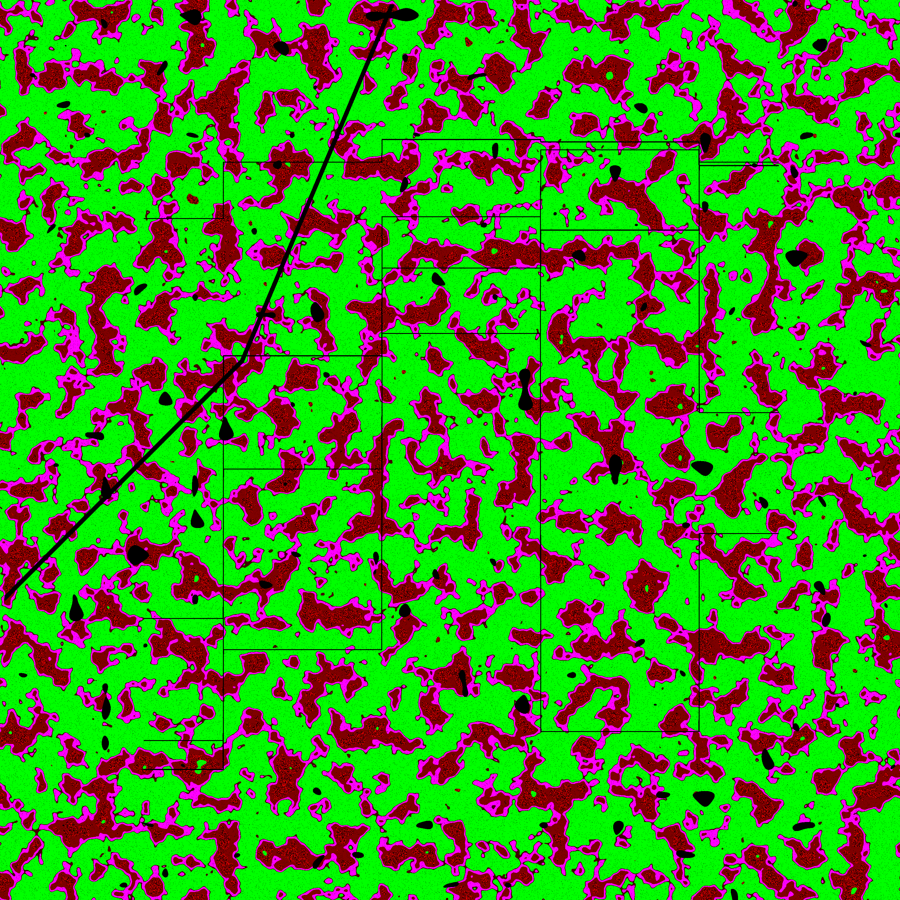
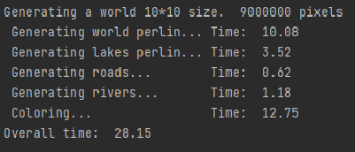

# Project Zomboid Terrain Generator

This is a small project aiming to generate terrain for the game called Project Zomboid. 

It uses perlin fractal noise, numpy, scipy, matplotlib and pillow.

This project is uses **multiprocessing** to speed up image processing. 
The image is split into 9 same sized chunks to ensure map data integrity and compatibility.

## The map

The generator creates simple lakes, rivers, roads, grasslands and forests of various thickness.

It is recommended to create maps larger than 3x3, 
but if you tweak some numbers it is fine for smaller maps as well.

## Usage

You may use it from any platform supporting python3 and libraries mentioned above.

When you run it from command line, the last argument is used as map width in chunks. 
An in-game chunk 300 pixels in width, the number you enter will be multiplied by this number. 

Recommended size is around 10, but it is capable of any size above 1. 
Sizes greater than 30 may require dozens of minutes of processing, as the map size grows exponentially.

### Output

The generator creates ground (grass) and vegetation maps as output.

### Terminal output:

### Things I might do later, but feel free to do it yourself 

- Optimize image processing (coloring)
- Generate foraging zones because for some reason it isn't tied to the map
- Better roads
- Better lakes

### LICENSE

You are free to use, modify and redistribute this code for any purpose, 
as long as you credit me in your readme and credit documents, and you also include the crediting
requirement in your license as well. Basically, be nice and have fun.